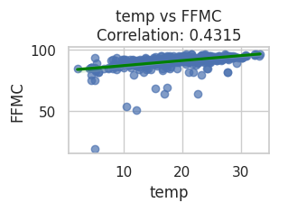
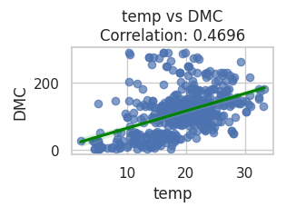
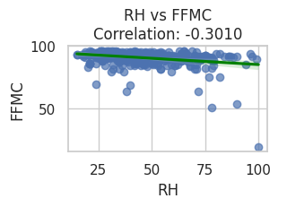
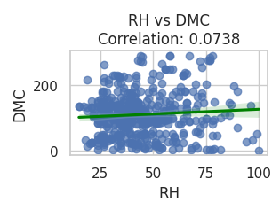

<!-- TABLE OF CONTENTS -->

  
Table of Contents

  <ol>
    <li>
      <a href="#about-the-project">About The Project</a>
    </li>
    <li>
      <a href="#introduction">Introduction</a>
    </li>
    <li><a href="#our-dataset--data-used">Our Dataset & Data Used</a></li>
    <li><a href="#our-research-question-and-hypotheses">Our Research Questions and Hypotheses</a></li>
    <li><a href="#linear-regression--results">Linear Regression & Results</a></li>
    <li><a href="#github--version-control">GitHub & Version Control</a></li>
    <li><a href="#conclusion--summary">Conclusion & Summary</a></li>
  </ol>

## About The Project
This project is a collaborative effort between [Shawn](https://github.com/toastyplains) and [Myself](https://github.com/michael-kudrik) for our principles of programming language final project. We will be using python with libraries such as `numpy`, `pandas`, etc. 

## Introduction
For our final presentation and project in COMSC 230, we took an interest in forest fires because we wanted to identify the principal issue regarding these natural disasters. We also felt that we could improve lives and preserve nature should we be able to discover the root causes of wildfires. As computer science majors, we recognized that certain data analysis tools could prove useful in diagnosing the principal issue. This principal problem is the destruction of wildlife and nature. Once we identified this problem, we sought to provide a gateway to potential solutions. This gateway was our data analysis of a particular set of forest fires.

## Our Dataset & Data Used
The dataset that we studied came from University of California, Irvine’s Machine Learning repository. The data contains details of various wildfires that occurred within the Montesinho National Park in Portugal. Some of the important variables are as follows:
- Fine Fuel Moisture Code (**FFMC**) - The FFMC measures the ease of ignition of twigs and other fine fuels. This means that a higher FFMC number indicates that it is easier for forest fires to start. 
- Duff Moisture Code (**DMC**) - A higher DMC means that the moderate-depth organic layers and medium-sized woody fuels are drier and therefore more prone to catching flame.  
- Temperature (**temp**)  - The temperature of the air can influence fire behavior and is important to take into consideration. A high temperature can also dry out fuels.
- Relative Humidity (**RH**) - The RH measures the amount of moisture in the air, which affects fire spread.

## Our Research Questions and Hypotheses
For this project, we brainstormed and drafted three main research questions that we sought to answer using our data analysis. These questions are listed below:
- How does the FFMC and DMC affect the possibility of wildfires?
- How does temperature and relative humidity affect FFMC & DMC?
- How can we use this information to help raise awareness and prevent forest fires in the future?

Using these research questions, we were able to formulate both a research and a statistical hypothesis that we attempted to prove using linear regression. Our research hypothesis stated “*If we discover the role that temperature and relative humidity play in FFMC and DMC rates, then we will be able to predict when forest fires occur.*” Our statistical hypothesis stated “*If temperatures are higher and relative humidity is lower, then the FFMC and the DMC will increase.*” We felt confident in our ability to successfully prove these hypotheses using the data analysis tools described below.

## Linear Regression & Results
We opted to use a linear regression model to check for correlations between variables. The following graphs are the result of conducting this analysis:
- Temp vs FFMC correlation: Pictured below in Figure 1 is the positive correlation between temperature and the Fine Fuel Moisture Code. This makes sense because as the air temperature rises, so does the air's capacity to hold more moisture, decreasing the relative humidity. As relative humidity decreases, and the air becomes more likely to draw moisture from the fuels; as such, the FFMC will increase. 

    

- Temp vs DMC correlation: Figure 2 (seen below) displays a positive correlation between temperature and Duff Moisture Code. As mentioned in the section above, as temperature increases, so does the evaporation rate. This increases the DMC. A higher temperature also affects humidity, and therefore will also have an effect on the DMC.

    

- RH vs FFMC: Figure 3 shows a slight negative correlation between relative humidity and the Fine Fuel Moisture Code. This is also a valid correlation because a higher relative humidity means that the air is saturated with more moisture. This moist air can transfer to the fuels, lowering their risk of fire and therefore lowering the FFMC.

    

- RH vs DMC: Using Figure 4, we concluded that there was little to no correlation between relative humidity and the Duff Moisture Code. This can be attributed to a variety of factors. For instance, a sudden increase in humidity may not impact deep duff layers, and may lag behind. A deep duff layer, which makes up most of the DMC, may be able to retain moisture for longer periods of time due to its high organic matter content. Since it is hard to pinpoint what the exact cause is, we can assume it has to do with the aforementioned reasons.

    

## GitHub & Version Control
For this project, we employed the use of GitHub (and by extension Git) to collaborate on the code. We began by initializing a GitHub repository: (https://github.com/michael-kudrik/forest_fire), and then we set up our project structure. The final code was merged to the main branch once our work was complete, while the working branch was designated for incomplete code. We each contributed our own commits to the project and were able to successfully collaborate on the data analysis.

## Conclusion & Summary
After analyzing our results, we were able to draw multiple valid conclusions.
Our statistical hypothesis was *fully supported* by the data. We were correct in assuming that the higher the RH, the lower the FFMC. We were also correct in assuming the higher the temperature, the higher the FFMC and the DMC. The data supports that higher temperatures make it easier for fine fuels and bigger woody fuels to ignite. This is valuable data that will help us in the future. Additionally, our research hypothesis was true and is verified. As we now know the role temperature and humidity play on FFMC and DMC rates, we can confidently propose that lower humidity rates and higher temperature rates increase the risk of forest fires. This information will prove invaluable should we attempt to continue this project and make a difference regarding forest fire awareness.

### References Used
References Used During Presentation
1. N. R. Canada, “Canadian Wildland Fire Information System | Canadian Forest Fire Weather Index (FWI) System.” Available: https://cwfis.cfs.nrcan.gc.ca/background/summary/fwi. [Accessed: Dec. 03, 2024]
2. P. Cortez and A. Morais, “Forest Fires.” UCI Machine Learning Repository, 2007. Available: https://doi.org/10.24432/C5D88D
3. “Hikes in Vinhais.” Available: https://www.outdooractive.com/en/hikes/vinhais/hikes-in-vinhais/221308080/. [Accessed: Dec. 03, 2024]
4. USFS/Mike McMillan, The 2013 Rim fire in and near Yosemite National Park. Available: https://assets.science.nasa.gov/dynamicimage/assets/science/esd/climate/2023/11/wildfire1-768px.jpg?w=1024&format=webp&fit=clip&crop=faces%2Cfocalpoint
